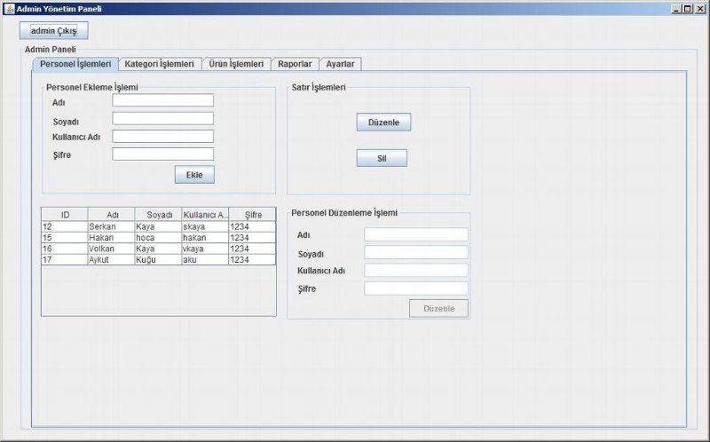
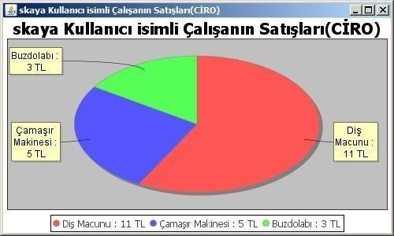
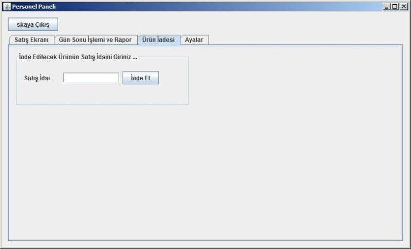
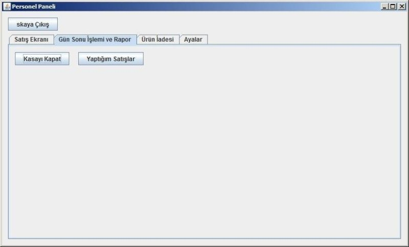
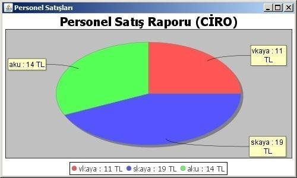
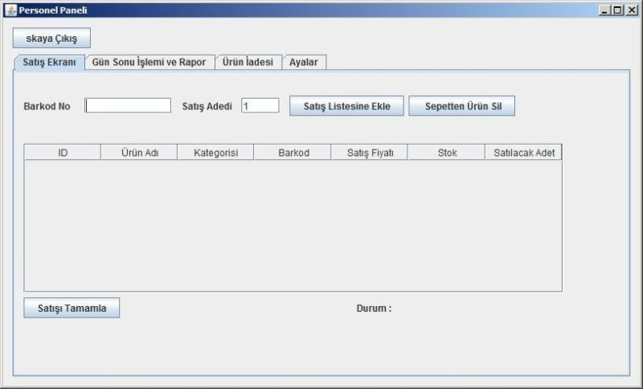

# MarketProjesi
Sqlite Java Swing ile yapılan bu proje bir marketin stok kontrol ve satışlarını hedeflemektedir.
jdk 1.8 yüklü olmalıdır ...
Netbeans IDE ile yapılmıştır ...
İlk Giriş Şifreleri :
Admin Girişi
Kullanıcı Adı : admin
Şifre 	        : 1234
Personel Girişi
Kullanıcı Adı : skaya
Şifre 	        : 1234
Yazılımın Genel Akışı :
Proje Yönetici ve Persol Girişi olmak üzere ikiye ayrılır ...
Yönetici Tarafında ;

Personel İşlemleri yapılabilecekler;
 Personel Ekleme
 Personel Silme
 Personel Düzenleme
 Personel Görüntüleme 
Kategori İşlemleri yapılabilecekler;
 Kategori Ekleme
 Kategori Silme
 Kategori Düzenleme
 Kategori Görüntüleme 
Ürün İşlemleri yapılabilecekler;
 Ürün Ekleme
 Ürün Silme
 Ürün Düzenleme
 Ürün Görüntüleme 
Raporlar bölümünde yapılabilecekler;
 Personele Göre Rapor Alma
 Tüm Personele Göre Rapor Alma
Ayarlar bölümünde yapılabilecekler;
 Şifre Değiştirme İşlemi
 
 Personel Girişi Tarafında ;

Satış Ekranı bölümünde yapılabilecekler;
 Satış İşlemi Barkoda Göre Yapılabilir
 Sepetten ürün silinebilir
Gün Sonu ve Rapor bölümünde yapılabilecekler;
 Gün Sonu ve Rapor işlemleri yapılabilir
Ürün İadesi bölümünde yapılabilecekler;
 Satis_id ye göre iade işlemi yapılabilir …
Ayarlar bölümünde yapılabilecekler;
Şifre Değiştirme İşlemi ...

MIT License

